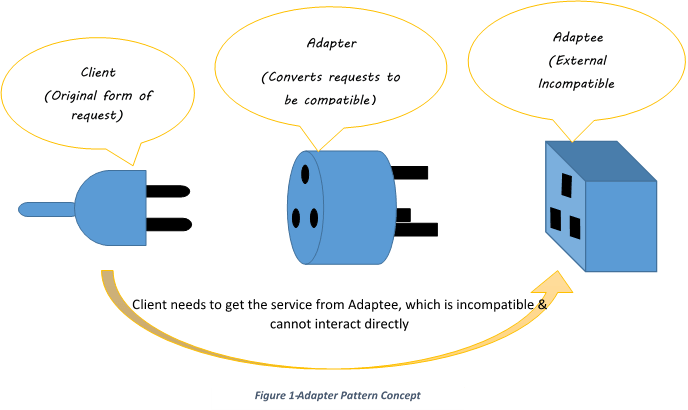
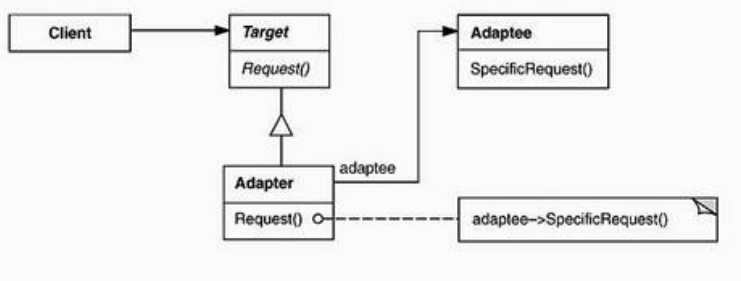
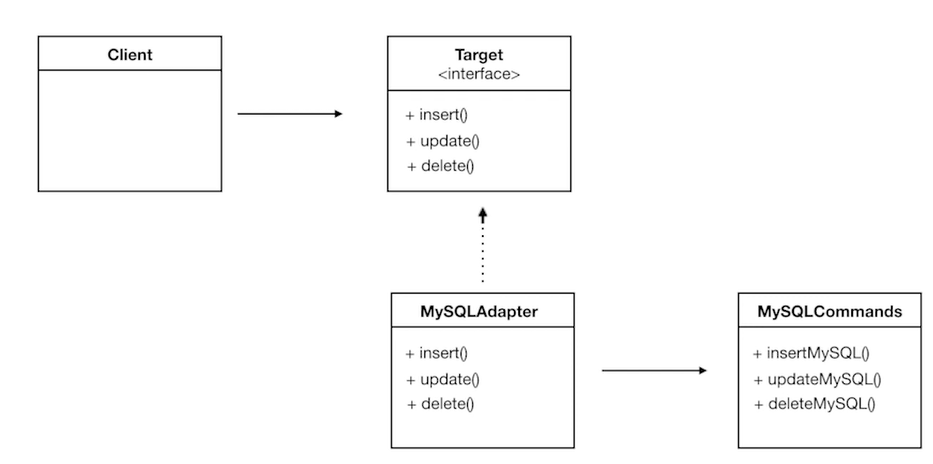
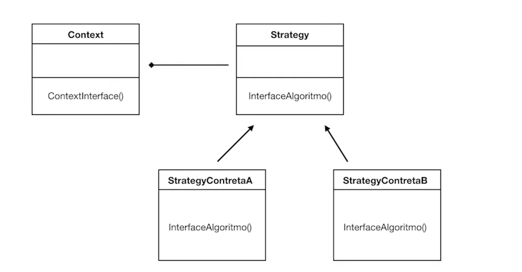

# Design Patterns

> Autor: @brenovambaster

Sumário:

- [Design Patterns](#design-patterns)
  - [1. Introdução](#1-introdução)
  - [2. Adapter ou Wrapper](#2-adapter-ou-wrapper)
    - [2.1 Intenção](#21-intenção)
    - [2.2 Estrutura](#22-estrutura)
    - [2.3 Participantes](#23-participantes)
    - [2.4 Exemplos que usaremos para demonstrar](#24-exemplos-que-usaremos-para-demonstrar)
  - [3 Strategy ou Policy](#3-strategy-ou-policy)
    - [3.1 Intenção](#31-intenção)
    - [3.2 Estrutura](#32-estrutura)
    - [3.3 Participantes](#33-participantes)
    - [3.4 Exemplos que usaremos para demonstrar](#34-exemplos-que-usaremos-para-demonstrar)

## 1. Introdução

 Design Patterns  Padrão de Projeto (P.P) é uma área de estudo dentro da engenharia de software que visa o melhoramento do código, de forma padronizada, para solucionar problemas  típicos encontrados no desenvolvimento de software.

 Pode-se fazer uma comparação com a construção de uma casa. Há problemas típicos encontrados desde o  projeto à  construção da casa em  si. Por ser problemas típicos que ocorrem na maioria (senão todas ) as vezes, cada um pode ter um jeito diferente de resolvê-los, não necessariamente todas as soluções são as mais viáveis, elegantes ou robustas. Na construção de um software não é diferente, traçar estratégias para solucionar um problema   típico é crucial, mas ainda não é suficiente. Deve-se sempre pensar que o sistema pode crescer tanto quanto queira. Diante disso,  construir um software que permita acrescentar novas funcionalidades e mudanças  de forma versáteis é de suma importância.

 Para tal, é necessário  desacoplar a dependência de código, construir funcionalidades mais genéricas, interfaces que permitam a comunicação entre objetos, classes, etc.  

 Resumindo, de forma simples, podemos dizer que P.P são soluções para problemas comuns encontrados no desenvolvimento ou manutenção de um software. Não são códigos prontos, mas sim  uma definição de alto nível generalista  de como um problema comum pode ser solucionado.

 **Podem ser divididos em duas categorias:** finalidade(que se divide em de **criação, estrutural e comportamental** ) e escopo(**classe ou objeto**).

 Os padrões de criação se preocupam  com o processo de criação dos objetos. Os padrões estruturais lidam com a composição de classes ou de objetos Os comportamentos tem o foco em maneiras pelas quais classes e objetos interagem entre si e de suas possibilidades. Neste trabalho, vamos dar ênfase em dois padrões de  projetos, o  **Adapter(Estrutural) e o Strategy(Comportamental)**

## 2. Adapter ou Wrapper

<!--
IMAGE REFERENCES
 https://www.google.com/url?sa=i&url=https%3A%2F%2Fitsnishantmishra.medium.com%2Fadapter-design-pattern-c-1cc8327f45d5&psig=AOvVaw13s6o0UNxWf6Ju_RCmexKj&ust=1670614832854000&source=images&cd=vfe&ved=0CBAQjRxqFwoTCJirjLDj6vsCFQAAAAAdAAAAABAD-->

### 2.1 Intenção

 Converter a interface de uma classe em outra interface, esperada pelos clientes. Permite que classes com interfaces  incompatíveis  comuniquem.
 Vejamos os diagramas a seguir:

### 2.2 Estrutura

 

### 2.3 Participantes

- **Target**: Define a interface específica que o Client utiliza
- **Client**: Colabora com os objetos compatíveis com a classe *Tagert*
- **Adaptee**: Classe que queremos nos comunicar
- **Adapta** a interface de Adaptee à interface Target para usarmos.

### 2.4 Exemplos que usaremos para demonstrar

[Link para o código fonte](https://#)
 

___

## 3 Strategy ou Policy

### 3.1 Intenção

Definir a família de algoritmos, encapsular esses algoritmos e usá-los dependendo da situação. Isso permite que o algoritmo varie independentemente dos clientes que o  utilizam

### 3.2 Estrutura

### 3.3 Participantes

- **Strategy:** Define uma interface comum para todos os algoritmos suportados.
- **ConcreteStrategy:** Implementa o algoritmo utilizando a interface de Strategy
- Contex:
  - é configurado com um objeto `ConcreteStrategy`
  - Mantém uma referência para um objeto Strategy
  - Pode definir uma interface que permite Strategy acesse seus dados

[Link para o código fonte](https://#)

### 3.4 Exemplos que usaremos para demonstrar
